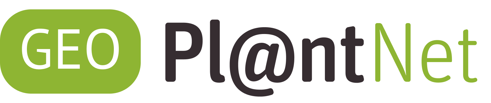

This is a list of Open Source tools that were developed, are being developed or will be developed partially or entirely by me during my PhD within the [Pl@ntNet](https://plantnet.org/) team.

[GeoPl@ntNet](https://maps.plantnet.org/viewer/)
======

    

A web application in the form of EU-wide interactive maps making Essential Biodiversity Variables easily accessible and understandable for everyone

[Pl@ntBERT](https://github.com/cesar-leblanc/plantbert)
======

    

A tool leveraging large language models to learn the "syntax" of species assemblages

[hdm-framework](https://github.com/cesar-leblanc/hdm-framework)
======

    

A classification framework to enhance your habitat distribution models

[malpolon](https://github.com/plantnet/malpolon)
======

    

A deep learning framework to help you build your species distribution models

[GeoLifeCLEF](https://github.com/plantnet/GeoLifeCLEF)
======

    

A toolkit (e.g., examples, dataloaders) for the GeoLifeCLEF challenge